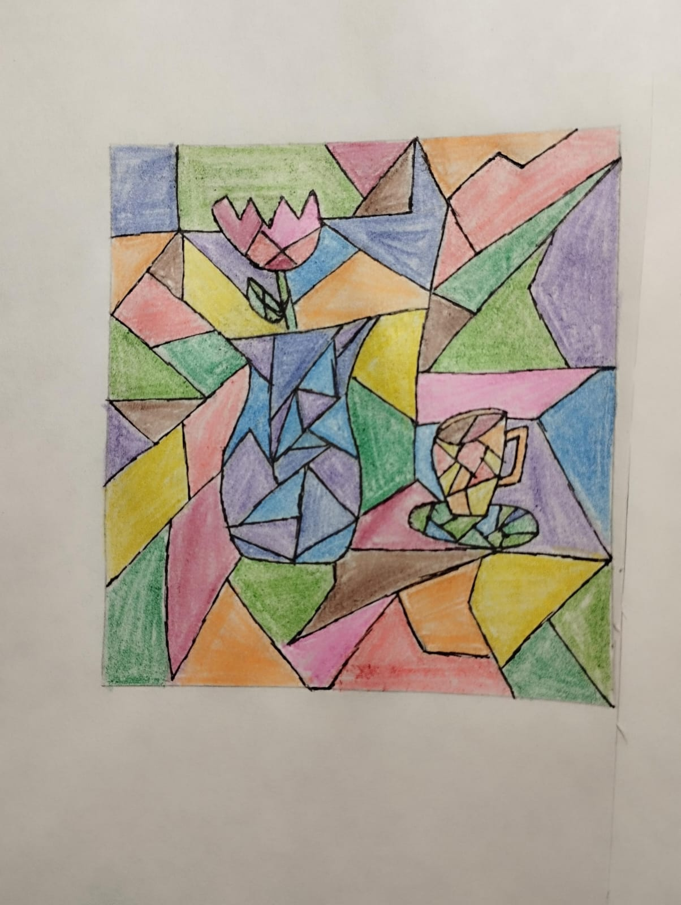
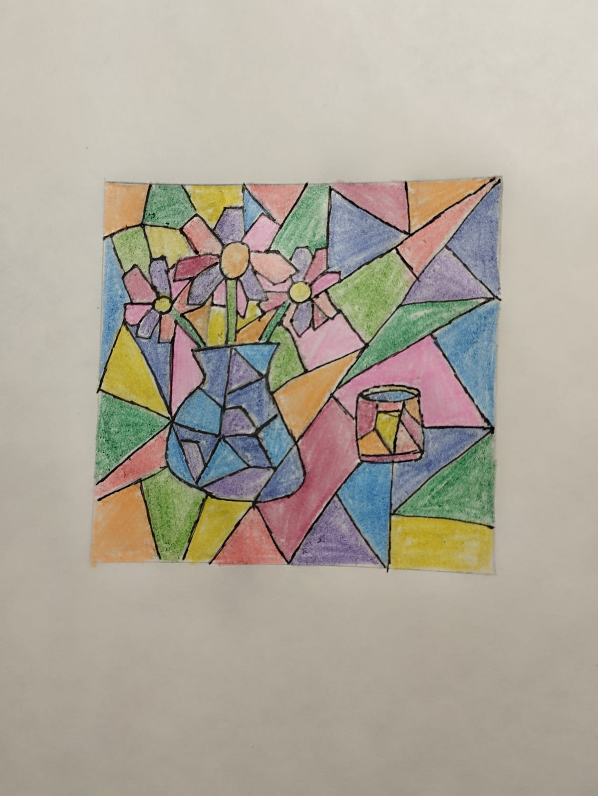

# Picasso-Inspired Abstract Still Life

This collection features two abstract still life compositions inspired by Pablo Picasso's Cubist style. Each piece reimagines everyday objects - vases and cups - through a fragmented, geometric lens.

I tried to create two similar versions to practice the cubist principles more.

## Final results

Version 1

Version 2

